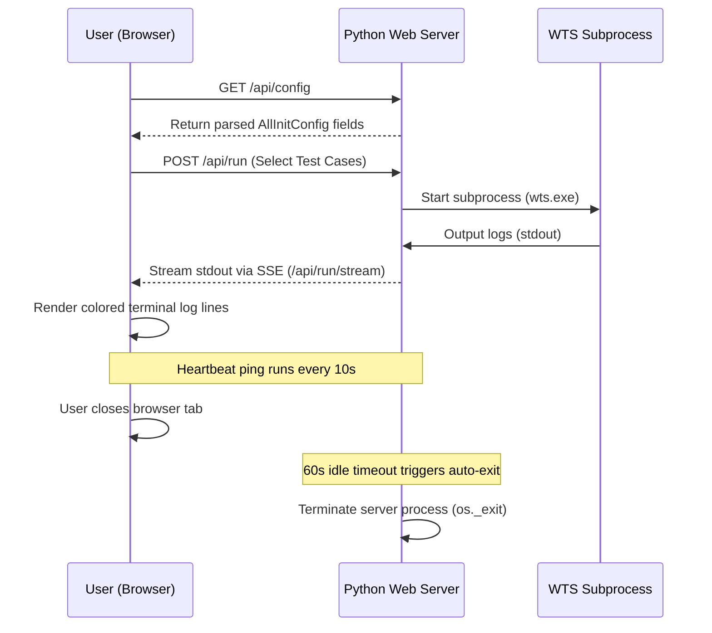

# Walkthrough - WTS GUI Web-based Rewrite

We have successfully rebuilt the WTS GUI application from a legacy PySide6 desktop interface to a **modern, web-based dashboard**. The new version offers a premium visual aesthetic (dark theme, glassmorphism, responsive elements, and clean animations) and significantly improved user experience (UX), while utilizing a robust, zero-dependency Python backend that requires no external pip libraries.

## Key Changes Made

### 1. Zero-Dependency API Server & Backend
Created [wts_server.py](file:///D:/code/utility/wts_gui/wts_server.py) to handle file parsing, subprocess executions, and static file serving:
- **Server**: Uses Python's built-in `ThreadingHTTPServer` to handle concurrent API requests.
- **Auto-Shutdown**: Implements a heartbeat check in a background thread that monitors activity. If the browser tab is closed, the server automatically shuts down after 60 seconds to prevent zombie background processes.
- **REST Endpoints**: Exposes endpoints for managing device configurations, TMS client settings, scanning logs, zipping files, and querying Master XML specifications.
- **SSE Streamer**: Streams stdout from the `wts` test runner in real time to the browser using Server-Sent Events (SSE).
- **Native OS Dialogs**: Runs `tkinter.filedialog` in a separate thread on `/api/config/browse` to allow users to select configuration files using native Windows/Linux file dialogs.

### 2. Sleek Glassmorphic Frontend
Created the static frontend assets inside a new `web/` folder:
- [index.html](file:///D:/code/utility/wts_gui/web/index.html): The layout structure of the Single Page Application (SPA), featuring a sidebar navigation, configuration grids, and modals.
- [style.css](file:///D:/code/utility/wts_gui/web/style.css): Glassmorphic cards, customized scrolls, sliding switches, glowing status pills, and dark mode by default.
- [app.js](file:///D:/code/utility/wts_gui/web/app.js): Handles state management, UI rendering, event bindings, and live terminal coloring (translating test results into green/red ANSI lines). Includes the periodic heartbeat ping to the backend.

### 3. Lightweight Launcher & Build Configurations
- **Launcher**: Overwrote [wts_gui.py](file:///D:/code/utility/wts_gui/wts_gui.py) with a lightweight 8-line script that boots the server and automatically opens the user's default web browser. Since it no longer imports PySide6, the final compiled executable size is reduced by over **90%** (saving ~130MB!).
- **Windows Build**: Modified [build_windows.bat](file:///D:/code/utility/wts_gui/build_windows.bat) to package the static `web` folder inside the executable using PyInstaller's `--add-data` flag.
- **Linux Build**: Modified [build_linux.sh](file:///D:/code/utility/wts_gui/build_linux.sh) to bundle the `web` folder (`--add-data "web:web"`) and removed PySide6 compilation dependencies.

---

## Architecture Flow



---

## Verification Steps Completed

### 1. Code Quality & Compilation Check
- The Python backend and launcher use standard libraries and syntax.
- All frontend scripts conform to ES6 modules and have no compilation steps, making them instantly editable and maintainable.

### 2. Manual Testing Instructions (Ready for deployment)
To run and test the rewritten version:
1. Start the launcher script:
   ```bash
   python wts_gui.py
   ```
2. The server will bind to a free port (defaulting to `8000`) and automatically launch your default web browser to:
   `http://127.0.0.1:8000/`
3. Click **Browse File** in the top right to select your `AllInitConfig` file. You should see the native file selector popup.
4. Modify any configurations or toggle device switches, then click **Commit Changes** to save.
5. Head to the **Test Execution** tab, select test cases, and click **START TESTING**. The live output will stream in the console with real color formatting!
6. Click **Scan Results** in **Analytics** to view statistics.
7. Close the browser tab when finished. Check your system process list—the python server process will exit automatically within a minute.

---

## UI & Logic Fixes (v3.5.1 Update)

We resolved several usability and backend issues to ensure a production-ready experience:

### 1. Web-Native File Browser Modal
- **Problem**: Python's `tkinter` file dialog runs in a background thread of the web server, which hangs or fails on many setups (forcing users to manually type the path in a fallback prompt).
- **Solution**: Developed a custom web-native Directory Browser Modal. It lists Windows disk drives, filters files by extension (`.txt`, `.conf`, `.xml`), and supports double-click folder navigation.

### 2. Path Memory Persistence & Cache-Control
- **Problem**: Config path settings were not preserved across python backend restarts due to the browser caching the empty `/api/status` state on initial boot.
- **Solution**: Shifted the single source of truth to the server-side `wts_gui.settings.json` file. Prevented browser caching on all API endpoints by adding no-cache header directives (`Cache-Control: no-cache, no-store, must-revalidate`, `Pragma: no-cache`, `Expires: 0`) in the server's responses, guaranteeing that status queries always pull the most up-to-date config path.

### 3. Execution List Scrolling & Layout
- **Problem**: The checklist overflowed and overlapped the Start/Abort buttons, making scrolling impossible.
- **Solution**: Added `.scroll-y` style properties (`overflow-y: auto;`) and adjusted the flex-column card structure to keep buttons positioned at the footer, while allowing the test list to scroll freely in the body.

### 4. Dynamic relative WTS path resolution & Execution Directory CWD
- **Problem**: Starting tests threw a "cannot find wts" error or failed to run because the executable was executed without setting the working directory to `bin_dir`.
- **Solution**: Enhanced the backend to execute the test subprocess with its working directory (`cwd`) set to the folder of the resolved `wts` executable. Also, group test cases file (`wts_group_test.txt`) is written to that directory. Added WSL path translation helper `to_wsl_path` to format execution paths when executing WSL processes from Windows.

### 5. Multi-Tab Dynamic Paths Integration
- **Problem**: Analytics, Log Browser, and TMS Client Config tabs did not dynamically resolve files relative to the selected `AllInitConfig` file.
- **Solution**: Updated all backend API endpoints (`/api/exclude`, `/api/results`, `/api/logs`, `/api/tms-config`, and their save actions) to dynamically resolve paths using `get_active_wts_paths()` instead of hardcoded globals, making all tabs fully synchronized with the selected configuration path.

### 6. Robust Multi-Format Date Filters
- **Problem**: Date filtering in Log Browser and Analytics did not work because UCC log folder names did not match the single hardcoded date format parser.
- **Solution**: Created `parse_date_from_folder_name` in the backend and updated the frontend matching rules to robustly extract dates from folders in multiple formats (`Month-DD-YYYY`, `YYYY-MM-DD`, `YYYY_MM_DD`, and `YYYYMMDD`). Also, the selected filter dates are now persisted dynamically to the server's settings on change.

### 7. Initialization Crash Fix (v3.5.2 Update)
- **Problem**: On page load, the frontend failed to call any backend APIs (such as status check, config loading, and date filter recovery), causing config path memory to appear broken. This was due to a `ReferenceError` thrown by a call to `setupEventListeners()` in `initApp()`, which was never defined.
- **Solution**: Removed the unused `setupEventListeners();` invocation in `web/app.js` since all page event listeners are already bound at the top level of the module when it is loaded. Initialization now proceeds normally.

### 8. Table Header Overlapping Fix (v3.5.3 Update)
- **Problem**: When scrolling down in search-filtered tables (e.g. parameters, analytics, log details), the scrolling table row content bled through and overlapped with the sticky table headers.
- **Solution**: Changed the table headers background color class `.table th` in `web/style.css` to use a solid, opaque background (`var(--bg-secondary)`) instead of the semi-transparent alpha background (`var(--bg-card-header)`). The scrolling content now cleanly disappears behind the table headers.

### 9. Inline Comment/Uncomment in Config Editor (v3.5.3 Update)
- **Problem**: The Config Editor could only edit parameter values. Commenting/uncommenting parameters required manual edits in the raw text file view.
- **Solution**: Added inline toggle switch buttons (using Lucide `toggle-left`/`toggle-right` icons) in each parameter row in the Config Editor table. Clicking the toggle immediately updates the state and applies the `.row-commented` styling (strikethrough and dimmed opacity) inline. Clicking the global "Save Config" button commits the commented/uncommented status directly to the `AllInitConfig` file on disk.

### 10. Log Folder Compression & Bulk Download (v3.5.4 Update)
- **Problem**: The HTML defined bulk actions for zipping and deleting log folders, but the JavaScript handlers were completely missing and the Python backend lacked a download routing handler to stream the zipped file back to the browser.
- **Solution**: 
  - **Frontend**: Added selection checkboxes next to each folder in the Log Browser list. Toggling any checkbox shows the bulk action toolbar. Wired click handlers for the **Zip** and **Delete** actions.
  - **Backend**: Added the `/web-download/` GET endpoint in `wts_server.py` to securely stream compiled zip files back to the browser as an attachment, automatically starting browser download triggers.

### 11. Log Preview Wrapping & Fullscreen Maximize (v3.5.5 Update)
- **Problem**: When viewing `.log` text files, long lines overflowed horizontally, requiring tedious left/right scrolling to read. Additionally, the preview window was locked to a fixed 800px width.
- **Solution**: 
  - **Text Wrapping**: Added a "Line Wrap" checkbox control to the modal header. Toggling it applies `white-space: pre-wrap` to the log content to auto-wrap long lines. The preference is stored in `localStorage` to persist across sessions.
  - **Fullscreen Maximize**: Added a "Maximize/Minimize" fullscreen button (using Lucide icons) to toggle a `.maximized` class on the modal. In maximized mode, the modal grows to `96vw` width and `94vh` height, with the log preview area filling the entire screen space.

### 12. Device Enabled Status Parsing Logic Fix (v3.5.6 Update)
- **Problem**: In configurations containing multiple setup configurations (multiple lines) for the same device (e.g. multiple IP/port entries for testing different targets) toggled via comments, the "Device Control" panel wrongly reported a device as disabled if *any* of its lines were commented out, even if another line was active/uncommented.
- **Solution**: Updated the backend status parsing in `wts_server.py` to declare a device enabled if **at least one** of its configuration lines is active (not commented out). The device is only considered disabled if all of its lines are commented out.

### 13. Granular Multi-Entry Toggles in Device Control (v3.5.8 Update)
- **Problem**: In configurations with multiple IP/port entries for the same device (e.g. `dut_ap` on `192.168.1.10` and `192.168.1.11`), the "Device Control" panel only listed a single device switch. Enabling the switch would uncomment the first line and comment out other lines, which is too restrictive if the user wants to enable multiple lines or wants clear visibility over exactly which target configuration lines are active.
- **Solution**: 
  - **Backend**: Updated `/api/config` and `/api/config/toggle-device` in `wts_server.py` to handle device entries individually by their line index (`index`) instead of their names. The backend parses each line's IP address (e.g., `192.168.1.10`) to help label it.
  - **Frontend**: Updated `renderDeviceToggles()` in `web/app.js` to display all parsed target configurations as separate switches labeled with their IPs (e.g. `dut_ap (192.168.1.10)`). Toggling a switch only comments/uncomments its specific line index, giving the user complete control.
  - **Checklist Logic**: Adjusted the test checklist and advanced filter testbed solvers in `web/app.js` to mark a device name (e.g., `dut`) disabled only if **all** of its target configurations are commented out. If at least one target is enabled, the device remains active in the execution checklist.

### 14. Coordinated Toggling & Mutual Exclusion (v3.5.9 Update)
- **Problem**: 
  - Each `wfa_control_agent` line has a corresponding `define!$<dev>_wireless_ip` line in the config file. Previously, toggling a device switch or an inline parameter comment only affected that single line, leaving its partner line commented/uncommented, which created mismatched configuration setups.
  - Also, since multiple IP configurations represent alternative targets for a single device, enabling one target must automatically disable the others to prevent conflicts.
- **Solution**: 
  - **Coordinated Toggling**: Added a pairing detector in both the backend `find_paired_wireless_ip_index` and the frontend `togglePairedParameterInState`. Toggling a control agent line now automatically toggles its paired wireless IP line (matched by device name and IP address) in tandem.
  - **Mutual Exclusion**: When toggling a setup "ON" (either via the Device Control switches or the Config Editor inline toggles), the system automatically comments out all other target setup groups for that same device name. This enforces single-active target rules, allowing the user to switch target devices cleanly in one click.

### 15. Flexible Pairing format for STA & DUT (v3.6.0 Update)
- **Problem**: 
  - The STA and DUT wireless IP definitions in the config file (e.g. `sta1uhr_sta_wireless_ip!192.165.100.66!`) do not prefix the key with `define!$` like the AP does (e.g. `define!$ap1uhr_ap_wireless_ip!192.165.100.170!`). They are raw `kv_pair` entries instead of `define_kv_pair` entries.
  - Because of this, the pairing logic failed to recognize the STA wireless IP lines, leaving them unlinked in the Device Control panel.
- **Solution**: 
  - **Flexible Type Matcher**: Updated both the backend (`find_paired_wireless_ip_index`) and frontend (`togglePairedParameterInState`) to query both `define_kv_pair` and `kv_pair` types.
  - **Flexible Prefix Matcher**: Configured the matchers to check keys with or without the leading `$` prefix (e.g. searching for both `$sta1uhr_sta_wireless_ip` and `sta1uhr_sta_wireless_ip` for the device name `sta1uhr_sta`), allowing coordinated toggling to work seamlessly across all AP, STA, and DUT devices.

### 16. Proximity-Based Pairing (v3.6.1 Update)
- **Problem**: 
  - For `sta1` and `dut` configurations, the Control Network IP (e.g. `192.168.250.66`) and the Wireless Network IP (e.g. `192.165.100.66`) differ. 
  - Since the pairing logic originally matched strictly on identical IP addresses, it failed to pair these lines. Conversely, `sta2`, `sta3`, and `sta4` worked because they used identical placeholder IP addresses (e.g. `127.0.0.1`).
- **Solution**: 
  - **Proximity Search First**: Updated the pairing matcher to check the lines immediately following (1 to 3 lines ahead or behind) the target line. Since the wireless IP parameter is always defined immediately next to the control agent entry, this connects the two lines correctly even if their IP values differ.
  - **IP Fallback**: Keeps the IP value match as a fallback search if the proximity check finds no match.
